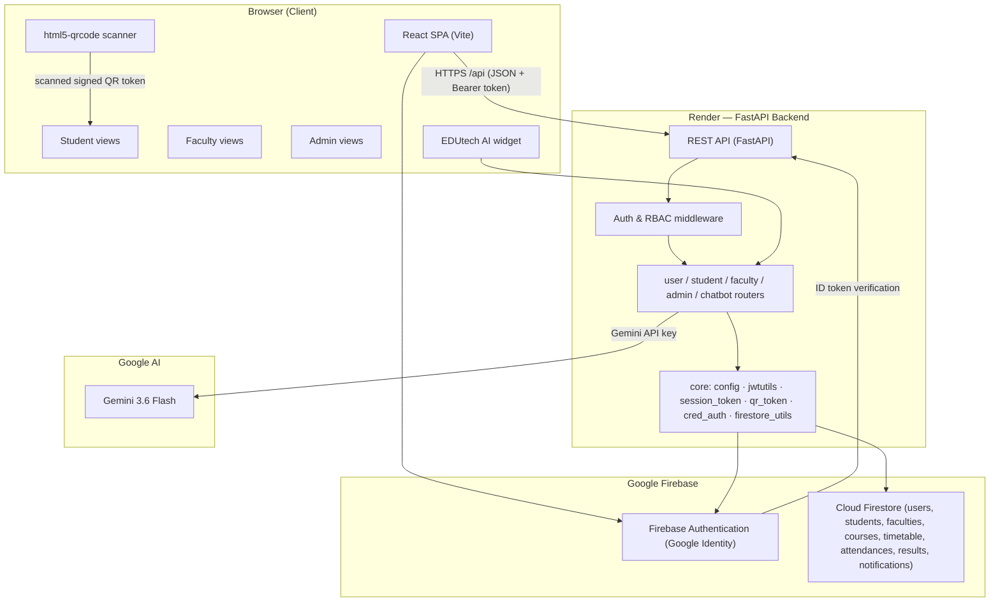
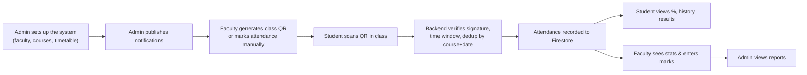
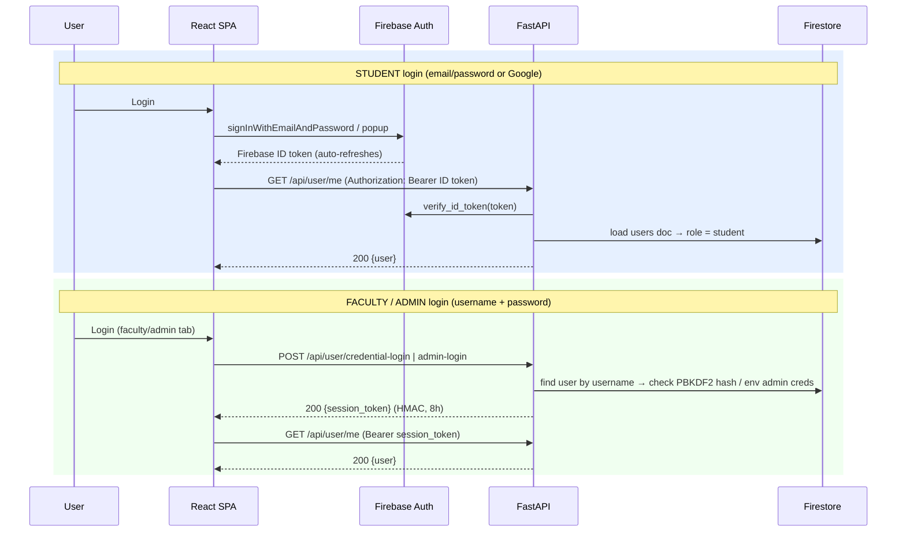
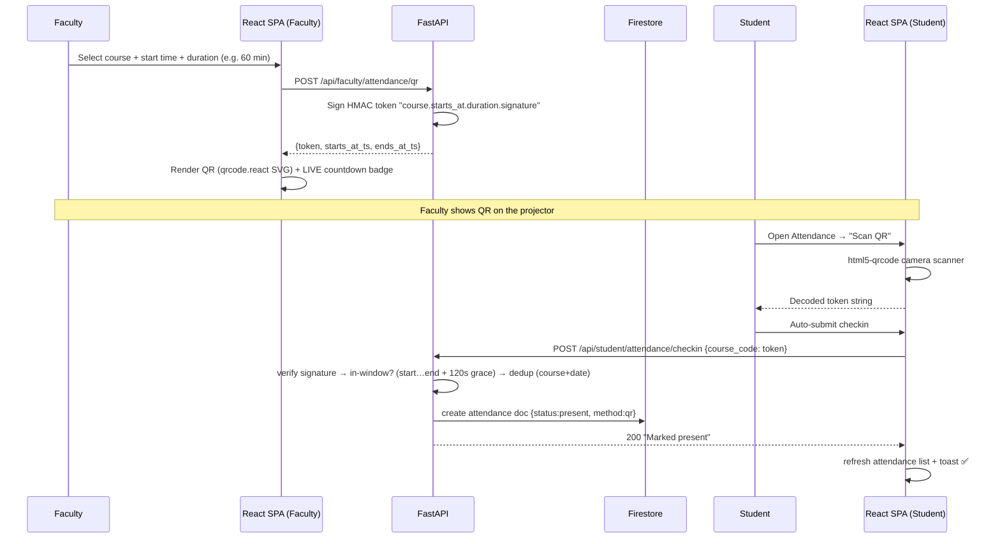
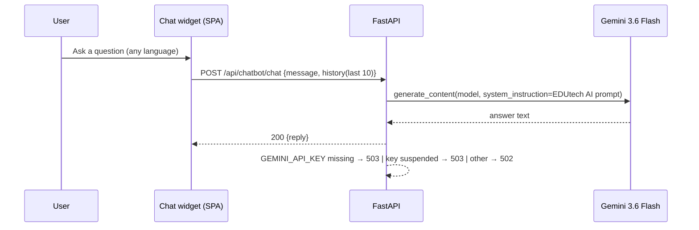
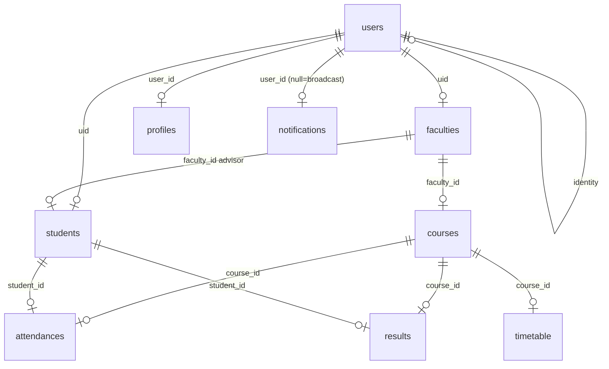

# EduCloude

**Secure Cloud Student Information Management System (SIMS) with Privacy Protection**

> "EduCloude — Connected on One Platform"

EduCloude is a full-stack web application that brings the entire college ecosystem — **students**, **faculty**, and **administrators** — onto one secure cloud platform. It handles student registration, QR-code–based **live lecture attendance**, faculty mark entry, results viewing, timetable management, notifications, system reports, and an in-app **AI chatbot** (EDUtech AI).

The app is built as a modern **three-tier architecture**:

| Tier | Technology | Responsibility |
|------|-----------|----------------|
| **Presentation** | React 19 + Vite (SPA) | Dashboards, QR scanning/display, chat widget, role views |
| **Application** | FastAPI (Python) | REST API, authentication, authorization (RBAC), business logic |
| **Data / Identity** | Firebase (Firestore + Authentication) | NoSQL database + Google-managed identity |

---

## Table of Contents

1. [Live URLs](#live-urls)
2. [Key Features](#key-features)
3. [Tech Stack](#tech-stack)
4. [System Architecture](#system-architecture)
5. [How the Application Works](#how-the-application-works)
6. [Feature Deep-Dive](#feature-deep-dive)
7. [Data Model (Firestore)](#data-model-firestore)
8. [API Reference](#api-reference)
9. [Project Structure](#project-structure)
10. [Local Development Setup](#local-development-setup)
11. [Deployment (Render)](#deployment-render)
12. [Security](#security)
13. [Troubleshooting & FAQ](#troubleshooting--faq)

---

## Live URLs

| Component | URL |
|-----------|-----|
| Frontend (React SPA) | `https://educloud-rssx.onrender.com` |
| Backend (FastAPI) | `https://educloude-backend.onrender.com` |
| Backend health check | `https://educloude-backend.onrender.com/health` |
| API docs (Swagger UI) | `https://educloude-backend.onrender.com/docs` |

> **Note about domains:** Render appends a random suffix when a service name is already taken globally, so the frontend is served from `https://educloud-rssx.onrender.com`. The backend allows **only this single origin** in CORS (`CORS_ORIGINS`), so that both browser logins (Firebase popup) and API calls work without being blocked.

---

## Key Features

**For Students**
- Register with email/password **or** Google (One-Tap) sign-up
- Personal dashboard with attendance %, average marks, timetable, mentor, notifications
- **QR-code attendance check-in** — point your phone camera at the projector and get marked present
- View detailed attendance history (present/absent + method: QR or manual)
- View results per course (internal, external, grade)
- Receive broadcast notifications
- Ask **EDUtech AI** — the in-app chatbot

**For Faculty**
- Dashboard with course load, attendance stats, student counts
- **Manual attendance**: select course + date, tick boxes, mark present (with per-student deduplication)
- **QR attendance**: generate a signed, time-limited QR code per course/class and display it live
- **Live window badge** — timer shows "Starts in… / LIVE / Expired" and updates every second
- Enter internal & external marks (0–50) with auto or manual grade computation (upsert)
- View their students and per-course reports

**For Administrators**
- Single-dashboard overview with system-wide counts
- Manage **students** (view/create/delete with cascade cleanup)
- Manage **faculty** accounts (username + hashed password, unique usernames)
- Manage **courses** and the **timetable** (reusable CRUD UI)
- Send **broadcast notifications** to all students
- View **reports** (system counts + faculty performance)

**Everywhere**
- Role-based dashboards with a shared layout, per-role sidebar, and unread-notification badge
- Floating **EDUtech AI** chat widget on every dashboard
- Toast feedback, friendly Firebase error messages, loading states

---

## Tech Stack

| Layer | Choice | Why |
|-------|--------|-----|
| Frontend framework | **React 19 + Vite** | Fast HMR, modern ESM build |
| Routing | **React Router v7** | Multi-role protected routes |
| UI/UX | **Custom CSS** (hand-rolled components) | No heavy UI framework, lightweight |
| QR rendering | **`qrcode.react`** (SVG) | Faculty shows the signed token as a scannable code |
| QR scanning | **`html5-qrcode`** | Camera-based scanner with manual-code fallback |
| State / API | React Context + fetch wrapper | Lightweight, no Redux overhead |
| Backend | **FastAPI 0.115 + Uvicorn** | Async REST, Pydantic validation, auto OpenAPI docs |
| Identity | **Firebase Authentication** (email/password + Google) | Google-managed, ID tokens verified server-side |
| Database | **Cloud Firestore** (NoSQL) | Serverless, realtime-friendly, generous free tier |
| Admin access | **Firebase Admin SDK (Python)** | Server-side token verification + Firestore access |
| AI chatbot | **Google Gemini (`gemini-3.6-flash`)** via `google-genai` | Free-tier fast model, multi-language answers |
| Password hashing | **PBKDF2-HMAC-SHA256** (100k iterations) | Faculty/admin credential storage |
| Token signing | **HMAC-SHA256 (base64url)** | Session + QR tokens, 8h TTL / signed time-window |

---

## System Architecture



### How the layers talk to each other

1. **Browser → Firebase Authentication** — the frontend uses the Firebase JS SDK for student login (email/password or Google popup). Firebase returns a short-lived **ID token**.
2. **Browser → FastAPI** — every API call goes over HTTPS with `Authorization: Bearer <token>`.
   - For students the token is the **Firebase ID token** (expires ~1h, automatically refreshed by the SDK).
   - For faculty/admin the token is a backend-issued **HMAC session token** (8h TTL).
3. **FastAPI middleware** — `parse_token` tries to verify a Firebase ID token first, then falls back to a session token, and finally resolves the user's role from the `users` collection. Per-router dependencies enforce **role-based access control** (student/faculty/admin).
4. **Backend → Firestore** — all business logic reads/writes Firestore through small helper utilities (`firestore_utils.py`) with timeouts, retries, and REST transport for hostile networks.
5. **Backend → Gemini** — `POST /api/chatbot/chat` streams the user's question + history to the Gemini model with a constrained system prompt.

---

## How the Application Works

### The everyday workflow



### Authentication flow (two identity schemes in one app)



### QR attendance workflow (the heart of the app)



Why every check-in is trustworthy:

1. **Signed, not guessable** — the scanned string is `course_code.<start_ts>.<duration_sec>.<hmac-sha256>` signed with the backend `SECRET_KEY`. Students can't forge one.
2. **Time is enforced** — the backend only accepts the token while `now ∈ [start, start + duration + 120s grace]`. A screenshot from yesterday is useless.
3. **One per day** — an existing attendance for the same course on the same calendar date is rejected ("Already marked present today").
4. **Manual fallback** — if scanning fails, a student can type the plain course code (e.g. `CS501`); it is treated as a raw code for the same dedup rules.

### EDUtech AI chatbot flow



---

## Feature Deep-Dive

### 1. Authentication & Security (all roles)

- **Students** authenticate through **Firebase Authentication** (email/password or Google). The backend verifies every ID token with the Firebase Admin SDK (`verify_id_token`) — no trust is placed in the client.
- **Faculty & Admin** authenticate with **username + password**. Passwords are stored as **PBKDF2-HMAC-SHA256 (100,000 iterations, 16-byte salt)** and compared in constant time.
- On success, the backend issues a **signed session token** (`HMAC-SHA256` base64url + `exp` claim, **8-hour TTL**) that the SPA keeps in `localStorage`.
- **Token resolution order**: the server tries the Firebase ID token first, then the session token — so one request pipeline serves both identity schemes.
- **Role-based access control** is enforced at the router level (`require_role("student")`, `require_role("faculty","admin")`, `require_role("admin")`) and returns **403** when a user tries to cross roles.
- **`SECRET_KEY`** signs both QR and session tokens. It must be stable in production (a random value is generated if unset, which would invalidate all sessions/QRs on every restart).
- Firebase Security Rules lock direct client access; all data access flows through the Admin SDK on the server.

### 2. Student Module

| Feature | How it works |
|---------|--------------|
| **Register** | Email/password or Google. Backend validates the faculty (advisor) exists, then upserts `users`, `profiles`, and `students` docs. On backend failure the Firebase user is deleted (rollback). |
| **Dashboard** | Profile card + stat cards (attendance %, subjects, avg internal/external) + timetable + mentor name + top-10 notifications, all served in one `/api/student/dashboard` call. |
| **Attendance history** | Full list of records (`date`, `status`, `method`, `course`) with live percentage. |
| **QR check-in** | Camera scanning via `html5-qrcode`; decoded token submitted to the backend, which verifies signature, time window (±120s grace), and dedupes per course+date. Manual course-code fallback included. |
| **Results** | Per-course internal marks, external marks, grade (joined with course name/code). |
| **Notifications** | Broadcasts (no `user_id`) plus personal messages, newest first, with an unread badge in the sidebar. |

### 3. Faculty Module

| Feature | How it works |
|---------|--------------|
| **Dashboard** | Course list, total students, attendance aggregate (`marked` count + percentage). |
| **Manual attendance** | Pick course + date, tick students, "Mark Selected / Mark All". Skipped if the student already has attendance for that course+date. Records `method=manual`, `marked_by`. |
| **QR generation** | Quick QR (now → +60 min) or custom (start time + duration validated 5–300 min). Returns a **signed** token rendered as an SVG QR with a real-time LIVE/Expired badge. |
| **Marks entry** | Internal (0–50) and external (0–50) validation, grade select (A+…F) or **auto-computed** from the total. **Upsert**: edits an existing result row instead of duplicating. |
| **Students list** | Only the faculty's own advisees. |
| **Reports** | Per-course attendance % and result-entry counts (also power the admin reports page). |

### 4. Admin Module

| Feature | How it works |
|---------|--------------|
| **Dashboard** | Top-level counts: students, faculty, courses, attendance records, result entries. |
| **Students** | Searchable, read-only table (name, roll, email, department, semester, faculty). Create works for placeholder rows; deleting cascades their attendance + result docs. |
| **Faculty** | Create accounts with unique username + password (≥6 chars, hashed with PBKDF2); stored as BOTH a `faculties` doc and a `users` doc (`uid = username`, `auth_type=credentials`). |
| **Courses** | Reusable CRUD table; duplicate course codes rejected; validates the faculty owner. |
| **Timetable** | Reusable CRUD table with a course dropdown; day/time/room per entry. |
| **Notifications** | Send to a role or broadcast to all students (`user_id` null = broadcast). |
| **Reports** | System counts + a "Faculty Performance" table reusing `/api/faculty/reports`. |

### 5. EDUtech AI Chatbot

- Floating assistant widget available on every dashboard.
- Runs on **`gemini-3.6-flash`** through the `google-genai` SDK with a guarded **system prompt** ("EDUtech AI").
- Answers questions about the app itself (QR attendance time-window model, results, marks, timetables, admin panel, roles) **and** common CS subjects (DSA, DBMS, OS, Computer Networks, Java/OOP, Python, AI/ML, Web Tech, Cloud, Cyber Security).
- **Language-aware**: replies in the user's language (English, Marathi, Hindi, …).
- **Privacy-guarded**: prompt rules forbid exposing private student data or passwords, and the chat history sent to the model is truncated to the last 10 messages.
- **Graceful degradation**: no `GEMINI_API_KEY` → `503 "AI assistant not configured"`; suspended/key-denied → friendly `503`; anything else → `502 "AI request failed"`. The UI shows a readable toast instead of crashing.

---

## Data Model (Firestore)

Firestore is a NoSQL document DB — there are no foreign keys, so relationships are stored as **ID references** and **deletion cascades are done in application code**.



### Collections

**`users`** — the identity/authorization table

| Field | Description |
|-------|-------------|
| `uid` | Firebase UID (students) **or** = username (faculty/admin) |
| `user_id` | UUID |
| `email`, `name` | Display identity |
| `role` | `student` / `faculty` / `admin` |
| `auth_type` | `firebase` or `credentials` |
| `username`, `password_hash` | faculty/admin only (PBKDF2 string) |
| `created_at`, `updated_at` | timestamps |

**`profiles`** — extra fields that don't belong on the auth doc

| Field | Description |
|-------|-------------|
| `profile_id`, `user_id` | keys |
| `roll_number`, `department`, `semester` | academic profile |

**`students`**

| Field | Description |
|-------|-------------|
| `student_id`, `user_id`, `uid` | keys |
| `name`, `email` | display |
| `roll_number`, `department`, `semester` | academic info |
| `faculty_id` | advisor faculty (nullable) |
| `created_at`, `updated_at` | timestamps |

**`faculties`**

| Field | Description |
|-------|-------------|
| `faculty_id`, `user_id`, `username` | keys |
| `name`, `email` | display |
| `department`, `subject` | expertise |
| `created_at`, `updated_at` | timestamps |

**`courses`**

| Field | Description |
|-------|-------------|
| `course_id`, `code` | keys (code like `CS501`, unique) |
| `name`, `department`, `semester`, `credits` | course details |
| `faculty_id` | owner faculty |

**`timetable`**

| Field | Description |
|-------|-------------|
| `timetable_id` | key |
| `course_id`, `day` (e.g. Monday), `time` (e.g. 09:00), `room` | schedule |

**`attendances`**

| Field | Description |
|-------|-------------|
| `attendance_id`, `student_id`, `course_id` | keys |
| `date` | `YYYY-MM-DD` |
| `status` | `present` / `absent` |
| `method` | `qr` or `manual` |
| `session_start` / `checked_in_at` | QR flow timestamps |
| `marked_by` | faculty user_id (manual flow) |

*Deduplication rule: one record per (student_id, course_id, date).*

**`results`**

| Field | Description |
|-------|-------------|
| `result_id`, `student_id`, `course_id` | keys |
| `internal_marks` (0–50), `external_marks` (0–50) | marks |
| `grade` | e.g. `A`, `B+` |
| `updated_by`, `updated_at`, `created_at` | audit |

*One row per (student_id, course_id) — faculty mark entry **upserts**.*

**`notifications`**

| Field | Description |
|-------|-------------|
| `notification_id`, `user_id` (null = broadcast) | targeting |
| `title`, `message`, `role`, `created_at` | content + delivery |

---

## API Reference

All endpoints live under `https://educloude-backend.onrender.com` (Swagger UI at `/docs`). Auth uses `Authorization: Bearer <token>`.

### `/api/user` — authentication & users

| Method | Path | Access | Purpose |
|--------|------|--------|---------|
| POST | `/api/user/register` | Firebase token | Student self-registration (links an existing seeded placeholder user) |
| POST | `/api/user/oauth/register` | Firebase token | Auto-register from Google OAuth |
| POST | `/api/user/credential-login` | — | Faculty login (username + password) → session token |
| POST | `/api/user/admin-login` | — | Admin login (env `ADMIN_USERNAME`/`ADMIN_PASSWORD`) |
| GET | `/api/user/faculty-list` | — | Public faculty picker for signup |
| GET | `/api/user/me` | any | Current user (id, email, name, role) |
| GET | `/api/user/me/profile` | any | Roll number, department, semester, faculty_id |

### `/api/student` — roles: `student`

| Method | Path | Purpose |
|--------|------|---------|
| GET | `/api/student/dashboard` | Aggregate dashboard payload |
| GET | `/api/student/attendance` | Attendance records + percentage |
| POST | `/api/student/attendance/checkin` | QR/raw course code check-in |
| GET | `/api/student/results` | Results joined with course info |
| GET | `/api/student/notifications` | Personal + broadcast notifications |

### `/api/faculty` — roles: `faculty`, `admin`

| Method | Path | Purpose |
|--------|------|---------|
| GET | `/api/faculty/dashboard` | Profile + courses + attendance stats |
| GET | `/api/faculty/attendance/qr/{course_id}` | Quick QR (now → +60 min) |
| POST | `/api/faculty/attendance/qr` | Custom QR (start time + 5–300 min duration) |
| POST | `/api/faculty/attendance/mark` | Manual attendance (dedup per course+date) |
| GET | `/api/faculty/students` | The faculty's own students |
| POST | `/api/faculty/results/enter` | Upsert marks (0–50 each) |
| GET | `/api/faculty/reports` | Per-course attendance % + result counts |

### `/api/admin` — roles: `admin`

| Method | Path | Purpose |
|--------|------|---------|
| GET/POST | `/api/admin/students` | List / create students |
| DELETE | `/api/admin/students/{id}` | Delete student + cascade attendances/results |
| GET/POST | `/api/admin/faculty` | List / create faculty (unique username, hashed password) |
| DELETE | `/api/admin/faculty/{id}` | Delete faculty + linked user + courses |
| GET/POST | `/api/admin/courses` | List / create courses (no duplicate codes) |
| DELETE | `/api/admin/courses/{id}` | Delete course + cascade attendances/results/timetable |
| GET/POST | `/api/admin/timetable` | List / add timetable entries |
| DELETE | `/api/admin/timetable/{id}` | Delete timetable entry |
| GET | `/api/admin/reports` | System-wide counts |
| GET/POST | `/api/admin/notifications` | List / send notifications (broadcast if `user_id` null) |

### `/api/chatbot`

| Method | Path | Access | Purpose |
|--------|------|--------|---------|
| POST | `/api/chatbot/chat` | — | Send message + history, get EDUtech AI answer |

---

## Project Structure

```
educloude/
├── backend/                        # FastAPI application
│   ├── app/
│   │   ├── core/                   # config, firebase init, firestore helpers,
│   │   │   │                       # jwt/session/QR token utils, credential auth
│   │   │   ├── config.py           # env-var loading + startup validation
│   │   │   ├── firebase.py         # Firebase Admin + Firestore (REST transport)
│   │   │   ├── firestore_utils.py  # add/get/query/update/delete helpers
│   │   │   ├── jwtutils.py         # Firebase ID-token + session-token resolution
│   │   │   ├── session_token.py    # HMAC session tokens (8h TTL)
│   │   │   ├── qr_token.py         # HMAC QR tokens with grace window
│   │   │   └── cred_auth.py        # PBKDF2 hashing + admin credential check
│   │   ├── routers/                # user, student, faculty, admin, chatbot
│   │   └── main.py                 # FastAPI entry + CORS + health + startup
│   ├── seed.py                     # demo data for Firestore
│   ├── requirements.txt
│   ├── .env.sample                 # template (fill real secrets locally)
│   └── firebase-service-account.json   # SECRET — never commit
├── frontend/                       # React (Vite) SPA
│   ├── src/
│   │   ├── components/             # DashboardLayout, Chatbot, QRScanner,
│   │   │   │                       # CRUDManager, Toast, GoogleIcon
│   │   ├── context/AuthContext.jsx # credential-session priority + Firebase auth
│   │   ├── lib/                    # firebase.js (wire-up) + api.js (Bearer fetch)
│   │   └── pages/                  # Login, Register, student/*, faculty/*, admin/*
│   └── .env.sample                 # template for Firebase web keys
├── render.yaml                     # Render Blueprint (backend + static frontend)
├── firebase.json / .firebaserc     # Firebase Hosting (optional)
└── README.md
```

---

## Local Development Setup

### Prerequisites

- Python 3.12+
- Node.js 18+
- A **Firebase project** with Authentication + Firestore enabled

### 1. Create / configure the Firebase project

1. [console.firebase.google.com](https://console.firebase.google.com) → **Add project**.
2. **Build → Authentication → Sign-in method** → enable **Email/Password** and **Google**.
3. **Build → Firestore Database** → create database (production mode).
4. **Project settings → Service accounts → Generate new private key** → download the JSON.
5. **Project settings → Your apps → Web app** (`</>`) → copy the web config keys.

### 2. Backend

```bash
cd backend
python3 -m venv venv && source venv/bin/activate
pip install -r requirements.txt
cp .env.sample .env
```

Fill `.env` (key names; values are your secrets):

| Key | Required | Purpose |
|-----|----------|---------|
| `FIREBASE_PROJECT_ID` | ✅ | Your Firebase project id |
| `FIREBASE_SERVICE_ACCOUNT_PATH` | ✅ (or `B64`) | Path to the downloaded service-account JSON |
| `FIREBASE_SERVICE_ACCOUNT_B64` | optional | Base64 of the JSON (preferred for Render secrets) |
| `CORS_ORIGINS` | ✅ | Comma-separated allowed browser origins |
| `SECRET_KEY` | recommended | Signs session + QR tokens (must be stable in prod) |
| `ADMIN_USERNAME` | optional | Default `jadav`; Render sets `EDU_project` |
| `ADMIN_PASSWORD` | optional | Default `EDUcloud@987` |
| `GEMINI_API_KEY` | optional | Enables EDUtech AI (503 without it) |

Run it:

```bash
python seed.py                # optional: demo data (faculties, courses, students, attendance, results, timetable, notifications)
python -m uvicorn app.main:app --host 0.0.0.0 --port 8000
```

API docs: http://localhost:8000/docs  ·  Health: http://localhost:8000/health

### 3. Frontend

```bash
cd frontend
npm install
cp .env.sample .env
```

Fill `.env` with the Firebase **web app** config plus the API base:

- `VITE_FIREBASE_API_KEY`, `VITE_FIREBASE_AUTH_DOMAIN`, `VITE_FIREBASE_PROJECT_ID`,
  `VITE_FIREBASE_STORAGE_BUCKET`, `VITE_FIREBASE_MESSAGING_SENDER_ID`, `VITE_FIREBASE_APP_ID`
- `VITE_API_URL` (e.g. `http://localhost:8000` for dev; the deployed SPA uses the Render backend)

```bash
npm run dev                   # http://localhost:5173
npm run lint                  # oxlint checks
npm run build                 # production build in dist/
```

> Dev tip: `vite.config.js` proxies `/api` → `http://localhost:8000`, so during local dev you can leave `VITE_API_URL` unset.

---

## Deployment (Render)

The app deploys from the **Render Blueprint** in `render.yaml` (free tier, region `singapore` for the backend):

### Service 1 — `educloude-backend` (FastAPI, `plan: free`)

- **Root:** `backend` · **Runtime:** Python (pinned `PYTHON_VERSION=3.12.11` because newer versions lack wheels for the pinned deps)
- **Build:** `pip install -r requirements.txt` · **Start:** `uvicorn app.main:app --host 0.0.0.0 --port $PORT`
- **Env:** all the backend keys from the local setup, including `FIREBASE_SERVICE_ACCOUNT_B64` (secret, `sync: false`) and `CORS_ORIGINS=https://educloud-rssx.onrender.com`.

### Service 2 — `educloud` (React SPA, static site)

- **Root:** `frontend` · **Build:** `npm ci && npm run build` · **Publish:** `dist`
- **SPA rewrite:** route `/*` → `/index.html` so deep links (e.g. `/student/attendance`) work on refresh.
- **Env:** `VITE_API_URL=https://educloude-backend.onrender.com` + the Firebase web keys.

### Why the SPA rewrite matters

Without it, refreshing `https://educloud-rssx.onrender.com/student/attendance` returns a 404 because the static host looks for a file that doesn't exist. The rewrite sends every path to the single-page `index.html`, and React Router renders the correct view.

### Firebase authorized domains (important)

Google login popups require the **serving domain** to be whitelisted. This is **console-only** (can't be changed via API):

1. Firebase console → **Authentication → Settings → Authorized domains**
2. Add `educloud-rssx.onrender.com`
3. (Also add your local dev origin, e.g. `localhost`.)

---

## Security

- **Firebase ID token verification** on every student request (Admin SDK).
- **PBKDF2-HMAC-SHA256** (100k iterations, random 16-byte salt) for faculty/admin passwords; constant-time comparison.
- **HMAC-signed session tokens** (8h TTL) for faculty/admin.
- **HMAC-signed QR tokens** with enforced start/end window + 120s grace; cannot be forged or replayed the next day.
- **Role-based access control** per router with 403 on cross-role access.
- **Server-side validation everywhere**: duplicate course codes, duplicate usernames, mark/result range checks (0–50), date-in-future checks, duration bounds.
- **Graceful error handling**: global 500 handler returns a generic message; chatbot degrades to readable 502/503 responses.
- **Secrets never committed**: `.env`, service-account JSON, and Firebase Admin keys are gitignored; production secrets come from Render env vars (`sync: false`).
- **Single-origin CORS**: only `https://educloud-rssx.onrender.com` is allowed to call the API from a browser.

---

## Troubleshooting & FAQ

**Q: Firebase error `auth/unauthorized-domain` when signing in with Google.**
→ Add the exact URL origin you're serving from (e.g. `https://educloud-rssx.onrender.com`) under Firebase console → Authentication → Settings → **Authorized domains**. This can only be done in the console.

**Q: The chatbot says "AI assistant is not configured".**
→ `GEMINI_API_KEY` is missing/empty on the backend. Set it in Render (backend service → Environment) and redeploy.

**Q: The chatbot returns "AI request failed".**
→ Usually a suspended/invalid API key, or the model quota is exhausted. Check `backend/.env` / the Render env var, then redeploy.

**Q: "Already marked present today" — I scanned twice.**
→ That's intentional: one check-in per course per day. It's not an error.

**Q: The QR code shows "Expired".**
→ The session window (start + duration + 2 min grace) ended. Generate a fresh QR for the next class.

**Q: WebSockets/long-request timeouts.** 
→ The backend forces the Firestore client onto HTTPS/REST transport (not gRPC) for hostile/firewalled networks — this is applied automatically.

**Q: Who is the default admin?**
→ On Render, `ADMIN_USERNAME=EDU_project` (password set via `ADMIN_PASSWORD`). Locally the default is `jadav` unless overridden in `backend/.env`. The login page pre-fills `EDU_project` for you.

**Q: Sessions invalidated after a redeploy?**
→ If `SECRET_KEY` is unset, a random key is generated at startup, invalidating all session + QR tokens. Set a stable `SECRET_KEY` in production.

**Q: Does the app work offline / is there a desktop app?**
→ No — it's a hosted web app (SPA + cloud APIs). It requires internet access.

---

## References

- [Render Blueprint File](./render.yaml)
- [Firebase Console](https://console.firebase.google.com)
- [Project review document](./EDUCloud_Review2%20(3).txt)

> **Note on the review document:** the phase-II concept document originally described a Java/Spring Boot + MySQL design. The implementation in this repository is **FastAPI + Cloud Firestore + Firebase Auth** — the architecture section above describes the real, running system.